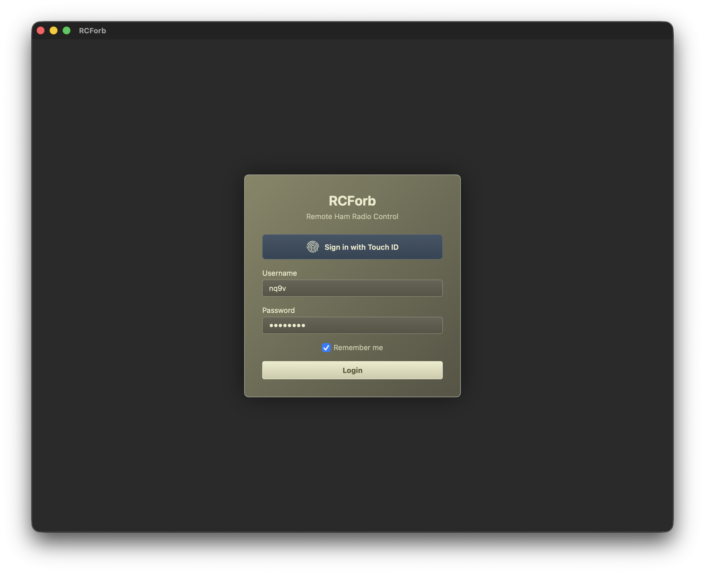
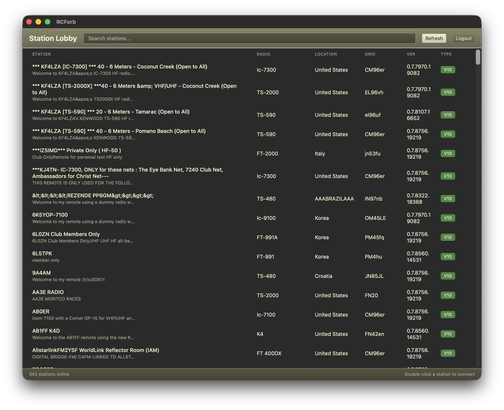
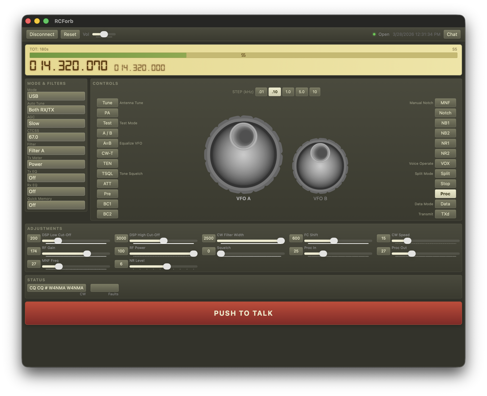
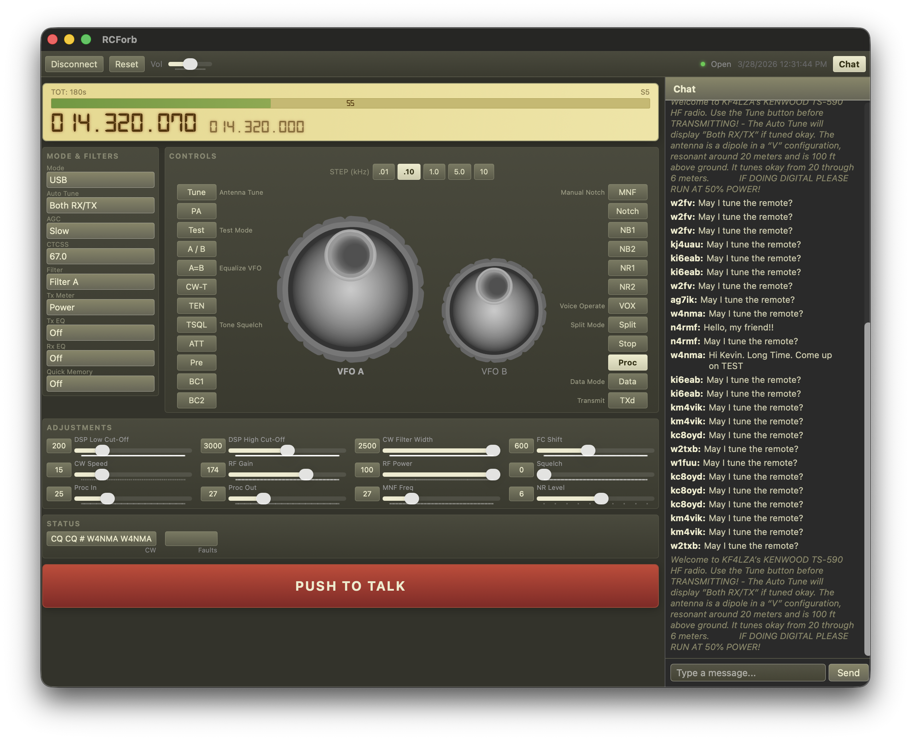

# RCForb Client

A multi-platform remote radio control client for [RemoteHams.com](https://www.remotehams.com) stations. RCForb allows amateur radio operators to connect to and control remote HF/VHF/UHF radio stations over the internet from anywhere in the world.

## What It Does

RCForb Client connects to RCForb Server instances published on RemoteHams.com, giving you full remote control of the radio including:

- **Frequency tuning** via VFO A/B knobs with configurable step sizes (10 Hz to 10 kHz)
- **Mode selection** (LSB, USB, AM, CW, FM, RTTY, and more)
- **Real-time audio streaming** (receive and transmit via Push-to-Talk)
- **S-meter display** with live signal strength readings
- **Full radio controls** including buttons, dropdowns, sliders for filters, noise reduction, AGC, squelch, and more
- **Split mode operation** for DX pileups (RX on VFO A, TX on VFO B)
- **Chat** with other operators connected to the same station
- **Rotator, amplifier, and antenna switch control** (when available on the remote station)

## Screenshots

### Login
Sign in with your RemoteHams.com credentials. Touch ID is supported on compatible Macs for quick access.



### Station Lobby
Browse available remote stations worldwide. Each listing shows the radio model, location, grid square, protocol version, and connection type.



### Radio Control Panel
Full radio control interface with VFO A/B tuning knobs, frequency display, S-meter, mode and filter selection, button controls, adjustment sliders, status readouts, and Push-to-Talk.



### Radio Control with Chat
The chat sidebar lets you communicate with other operators connected to the same station in real time.



## Platform Support

| Platform | Status | Technology | Distribution |
|----------|--------|-----------|--------------|
| macOS (Apple Silicon) | Available | Swift / SwiftUI | ZIP archive in `dist/macos/` |
| iPadOS | Developed, awaiting device testing | Swift / SwiftUI | Build from source |

## Installation

### macOS (Apple Silicon)

Download the latest pre-built ZIP archive from `dist/macos/`:

- **[RCForb Client-1.0.4-arm64-20260328-092834.zip](dist/macos/RCForb%20Client-1.0.4-arm64-20260328-092834.zip)** (latest)
- `RCForb Client-1.0.3-arm64.zip`

> Note: The app is not code-signed or notarized. On first launch, right-click the app and select "Open" to bypass Gatekeeper, or go to System Settings > Privacy & Security to allow it.

### iPadOS

The iPadOS app has been developed but is awaiting testing on a physical device. To build from source:

```bash
cd ipadOS/RCForb
swift build
```

## Project Structure

```
RCForb/
  macOS/             macOS desktop app (Swift/SwiftUI)
  ipadOS/            iPadOS app (Swift/SwiftUI)
  dist/              Pre-built archives
    macos/           macOS ZIP archive
  docs/              Protocol specification and documentation
```

## Building from Source

### macOS

```bash
cd macOS/RCForb
swift build        # Debug build
swift run          # Run in development
```

### iPadOS

```bash
cd ipadOS/RCForb
swift build
```

### Prerequisites

- Swift 5.9+
- macOS 14+ (Sonoma) or iPadOS 17+
- libopus and libspeex are bundled with the app

## Protocol

RCForb uses a custom protocol over UDP (V10, Opus audio) or TCP (V7, Speex audio) to communicate with RCForb Server instances. The full protocol specification is documented in `docs/PROTOCOL_SPECIFICATION.md`.

## Author

Ramon E. Tristani (raytristani@gmail.com)

## License

MIT
