# RCForb Client

A multi-platform remote radio control client for [RemoteHams.com](https://www.remotehams.com) stations. RCForb allows amateur radio operators to connect to and control remote HF/VHF/UHF radio stations over the internet from anywhere in the world.

## What It Does

RCForb Client connects to RCForb Server instances published on RemoteHams.com, giving you full remote control of the radio including:

- **Frequency tuning** via VFO A/B knobs with configurable step sizes (10 Hz to 10 kHz)
- **Mode selection** (LSB, USB, AM, CW, FM, RTTY, and more)
- **Real-time audio streaming** (receive and transmit via Push-to-Talk)
- **S-meter display** with live signal strength readings
- **Full radio controls** including buttons, dropdowns, sliders for filters, noise reduction, AGC, squelch, and more
- **Split mode operation** for DX pileups (RX on VFO A, TX on VFO B)
- **Chat** with other operators connected to the same station
- **Rotator, amplifier, and antenna switch control** (when available on the remote station)

## Screenshots

### macOS

#### Login
Sign in with your RemoteHams.com credentials. Touch ID is supported on compatible Macs for quick access.

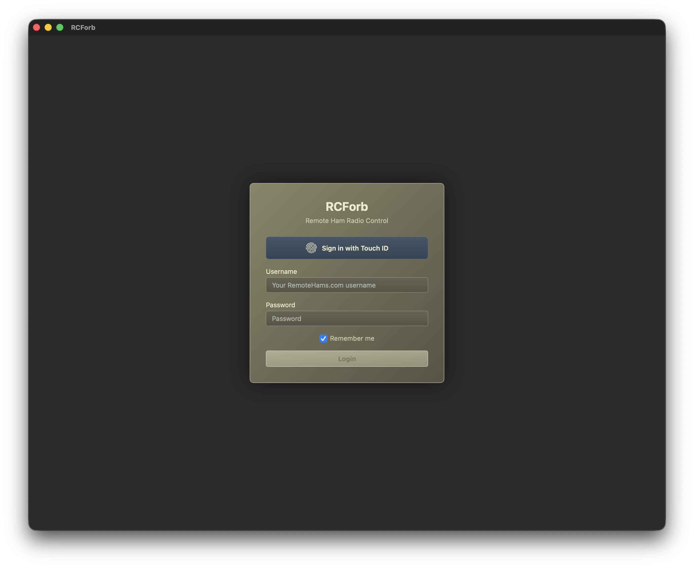

#### Station Lobby
Browse available remote stations worldwide. Each listing shows the radio model, location, grid square, protocol version, and connection type.

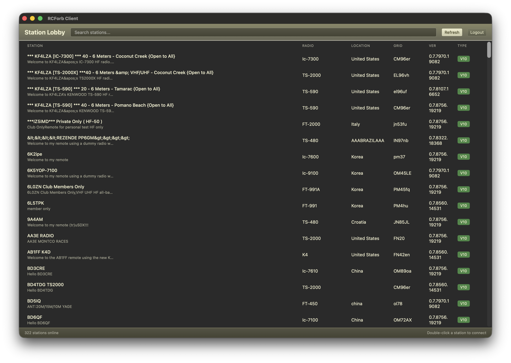

#### Radio Control Panel
Full radio control interface with VFO A/B tuning knobs, frequency display, S-meter, mode and filter selection, button controls, adjustment sliders, status readouts, and Push-to-Talk.

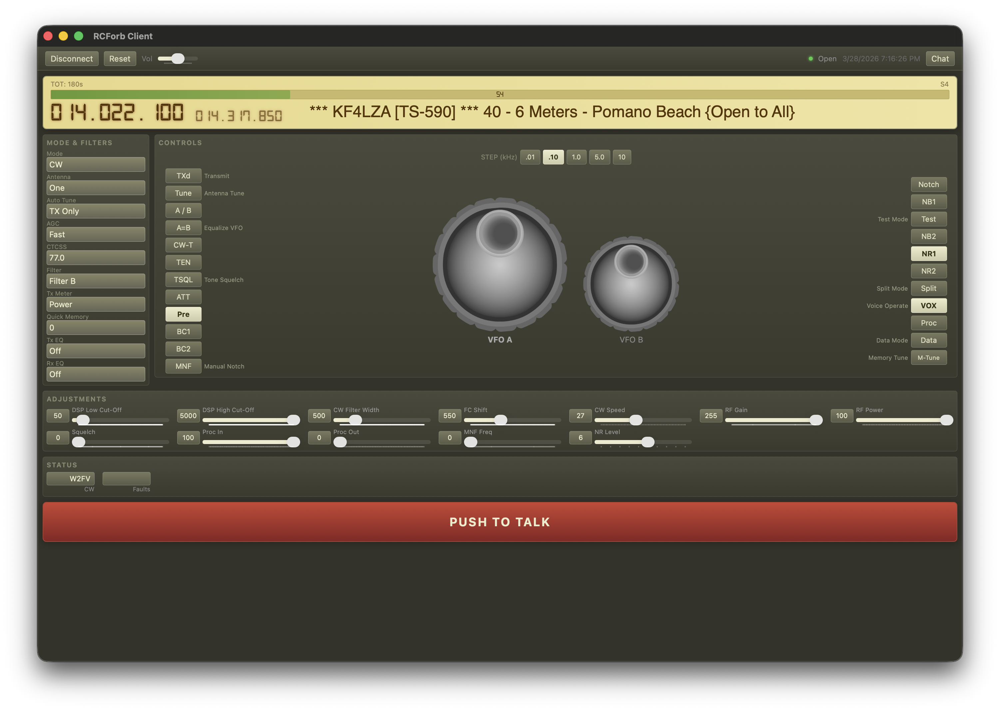

#### Radio Control with Chat
The chat sidebar lets you communicate with other operators connected to the same station in real time.

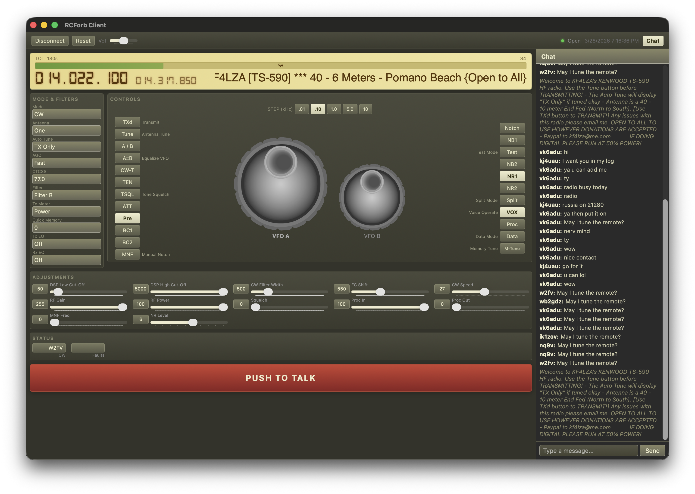

### iPadOS

#### Login
Sign in with your RemoteHams.com credentials on iPad.

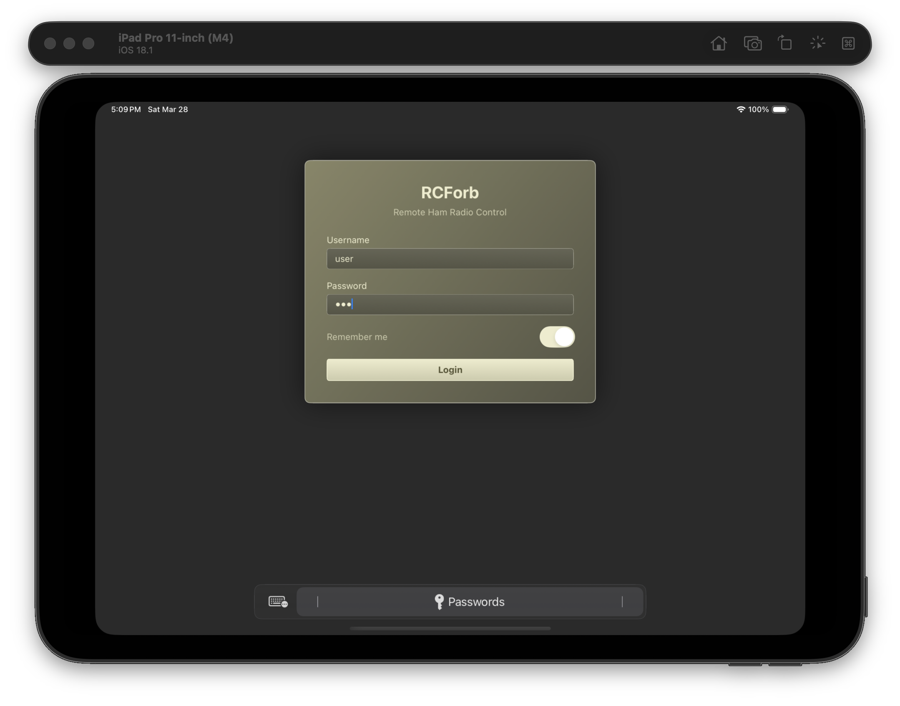

#### Station Lobby
Browse and connect to remote stations with a touch-optimized interface. Tap a station to select, tap again to connect.

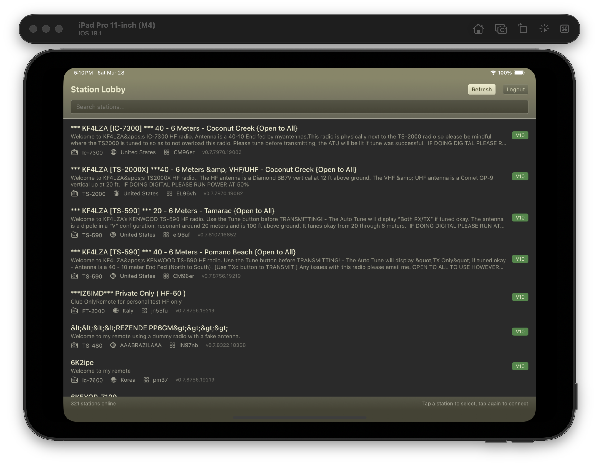

#### Radio Control Panel
Compact single-screen layout optimized for iPad with VFO knobs, controls, adjustment sliders, and Push-to-Talk all visible at once.

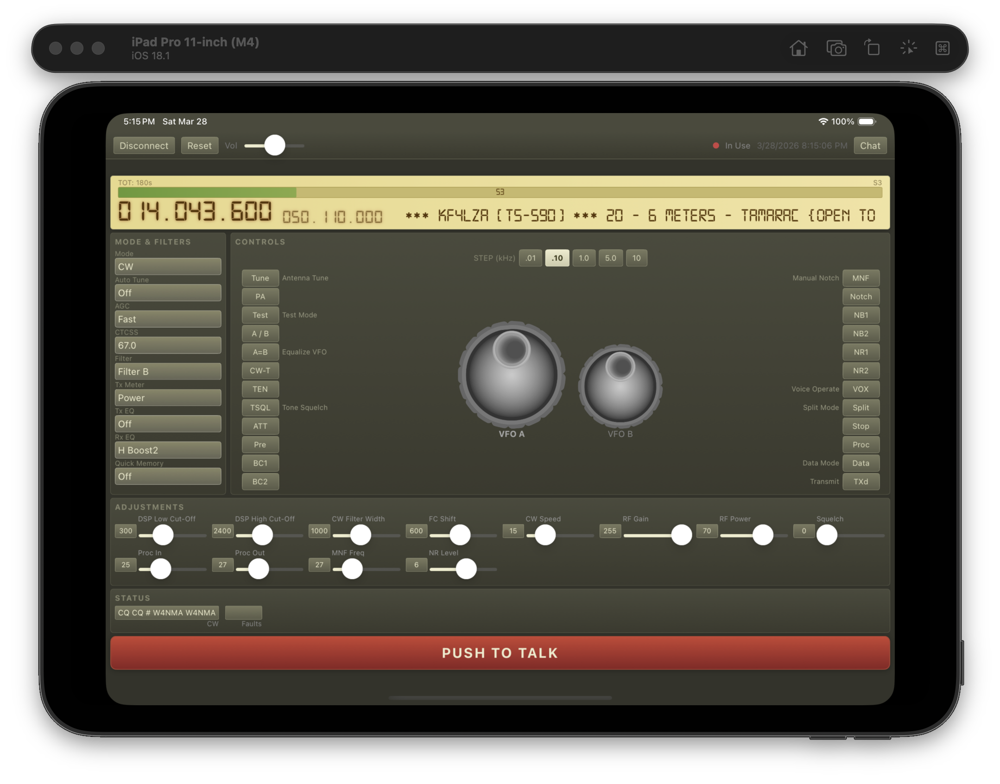

#### Radio Control with Chat
Chat sidebar for communicating with other operators connected to the same station.

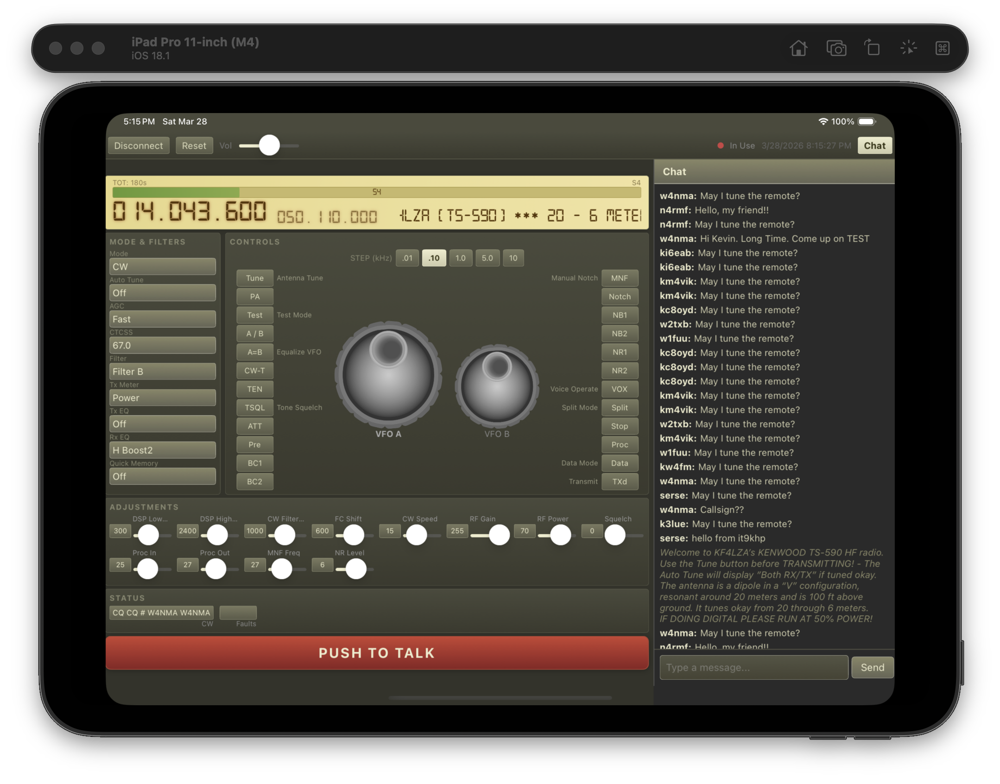

### Android

#### Login
Sign in with your RemoteHams.com credentials on Android tablets.

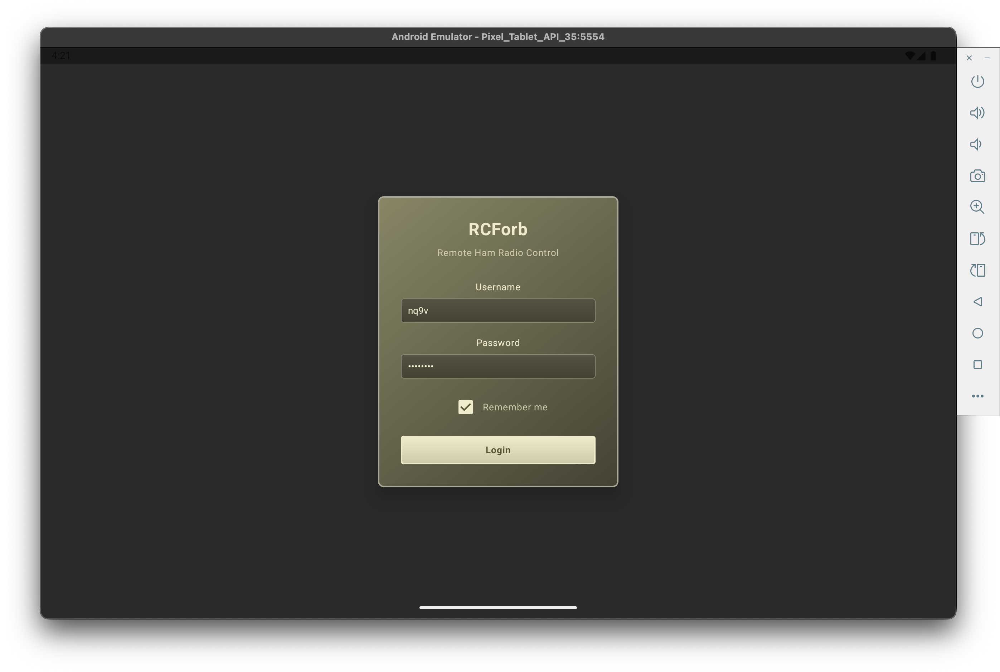

#### Station Lobby
Browse available remote stations with Material Design interface. Tap a station to connect.

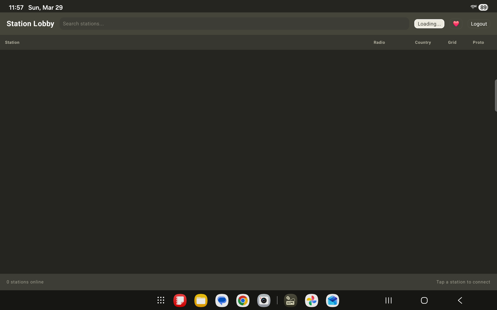

#### Radio Control Panel
Full radio control interface built with Jetpack Compose, featuring VFO knobs, button grid, adjustment sliders, and Push-to-Talk.

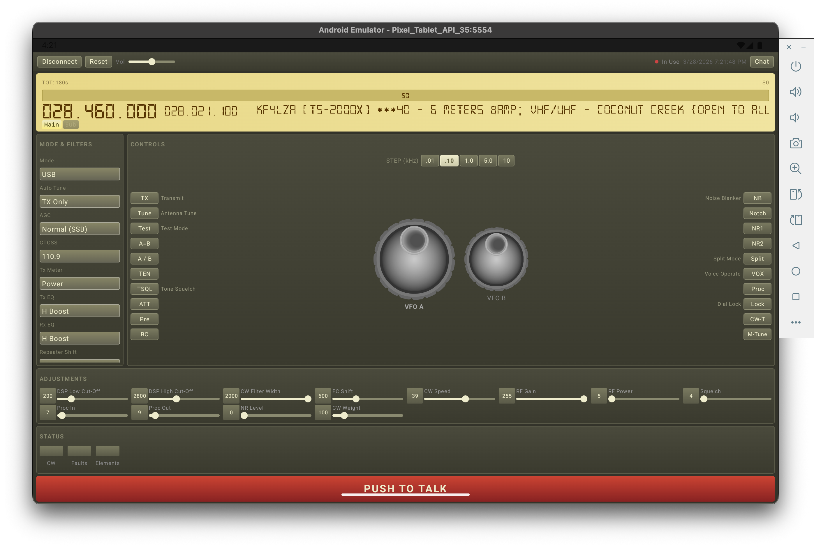

#### Radio Control with Chat
Chat panel for real-time communication with other operators on the station.

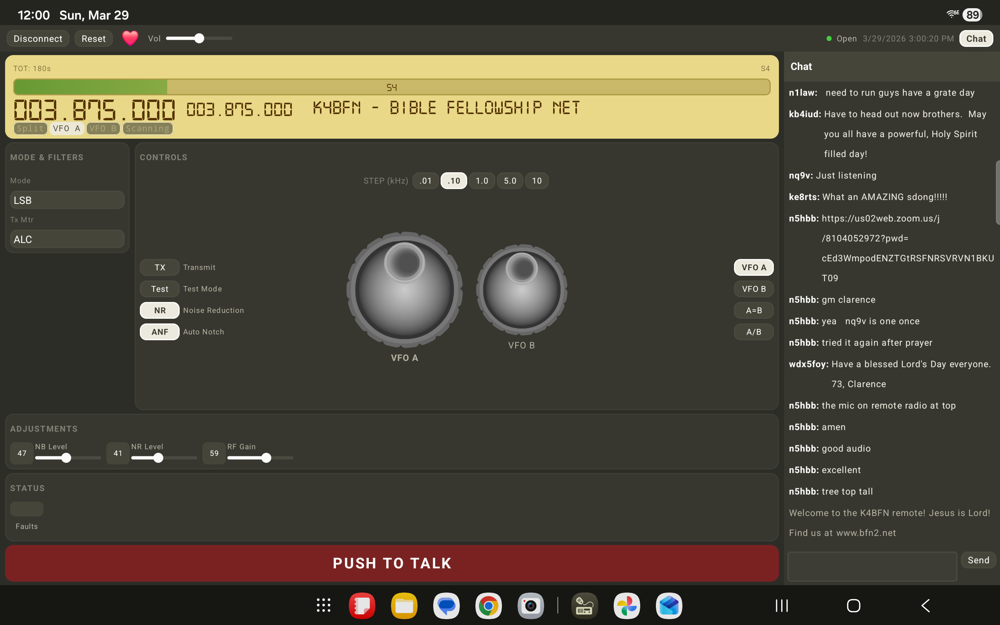

## Platform Support

| Platform | Status | Technology | Distribution |
|----------|--------|-----------|--------------|
| macOS (Apple Silicon) | Available | Swift / SwiftUI | ZIP archive in `dist/macos/` |
| iPadOS | Available (simulator tested) | Swift / SwiftUI | Build from source via Xcode |
| Android | Available (tablet tested) | Kotlin / Jetpack Compose | Build from source via Gradle |

## Installation

### macOS (Apple Silicon)

Download the latest pre-built ZIP archive from `dist/macos/`:

- **[RCForb Client-1.0.8-arm64-20260329-212055.zip](dist/macos/RCForb%20Client-1.0.8-arm64-20260329-212055.zip)** (latest)
- `RCForb Client-1.0.6-arm64-20260328-160200.zip`
- `RCForb Client-1.0.5-arm64-20260328-131948.zip`
- `RCForb Client-1.0.4-arm64-20260328-092834.zip`
- `RCForb Client-1.0.3-arm64.zip`

> Note: The app is not code-signed or notarized. On first launch, right-click the app and select "Open" to bypass Gatekeeper, or go to System Settings > Privacy & Security to allow it.

### iPadOS

The iPadOS app has been tested on the iPad Pro 11-inch (M4) simulator. To build from source, open the Xcode project:

```bash
cd ipadOS/RCForb
open RCForb.xcodeproj
# Select iPad simulator target, then Build & Run
```

Or build via command line:

```bash
cd ipadOS/RCForb
xcodebuild -project RCForb.xcodeproj -scheme RCForb -sdk iphonesimulator -destination "platform=iOS Simulator,name=iPad Pro 11-inch (M4)" build
```

### Android

The Android app has been tested on the Samsung Galaxy Tab S11 and Pixel Tablet emulator (API 35). Requires Android NDK 27+ for native Speex audio decoding. To build from source:

```bash
cd android
./gradlew assembleDebug
```

Requires Android Studio or the Android SDK with API level 26+ (Android 8.0), plus Android NDK 27+ and CMake for native Speex audio decoding. The app uses Jetpack Compose for the UI, MediaCodec for Opus, and native libspeex via JNI for Speex audio.

## Project Structure

```
RCForb/
  macOS/             macOS desktop app (Swift/SwiftUI)
  ipadOS/            iPadOS app (Swift/SwiftUI)
  android/           Android app (Kotlin/Jetpack Compose)
  dist/              Pre-built archives
    macos/           macOS ZIP archive
  docs/              Protocol specification and documentation
```

## Building from Source

### macOS

```bash
cd macOS/RCForb
swift build        # Debug build
swift run          # Run in development
```

### iPadOS

```bash
cd ipadOS/RCForb
open RCForb.xcodeproj    # Build & Run from Xcode
# or via command line:
xcodebuild -project RCForb.xcodeproj -scheme RCForb -sdk iphonesimulator build
```

### Android

```bash
cd android
./gradlew assembleDebug
# Install on connected device/emulator:
adb install app/build/outputs/apk/debug/app-debug.apk
```

### Prerequisites

- Swift 5.9+ (macOS/iPadOS)
- macOS 14+ (Sonoma) or iPadOS 17+
- Android SDK API 26+, Kotlin 1.9+, NDK 27+, CMake 3.22+ (Android)
- libopus and libspeex are bundled with the macOS app
- libspeex 1.2.1 is compiled from source via NDK/JNI for Android

## Test Stations

Public stations with TX enabled that can be used for testing PTT and audio:

| Station | Radio | Notes |
|---------|-------|-------|
| LARC | IC-7300 | London Amateur Radio Club, public |
| SV1BMQ | IC-7300 | Public, Greece |
| HR5HAC | Kenwood TS-50 | Public, Honduras |
| ZL1HN | IC-7100 | Public, New Zealand |
| ZS6WDL | IC-7300 | Public, South Africa |
| W6JFA | IC-7610 | Public, EFHW antenna |
| KE6GG | IC-7300 | Public |
| K6BJ DeLa | TS-570 | Public, Santa Cruz CA |

> Note: Most stations require you to request tune permission before transmitting. Type "May I tune the remote?" in the chat window and wait for approval. Some stations may require owner approval which can take time.

## Protocol

RCForb uses a custom protocol over UDP (V10, Opus audio) or TCP (V7, Speex audio) to communicate with RCForb Server instances. The full protocol specification is documented in `docs/PROTOCOL_SPECIFICATION.md`.

## Changelog

### v1.0.8 (2026-03-29)

**macOS — Full Android Parity:**
- **Color parity** — All hardcoded hex colors replaced with semantic tokens matching Android AppColors exactly. Every component cross-referenced against Android source.
- **Selection highlight** — NSTableView row selection swizzled to cream (#ECEADE) instead of system blue. Selected row text inverts to dark for readability.
- **Lobby UX** — Connect button in header, double-click to connect via NSTableView hook, alternating row backgrounds.
- **PTT fixes** — TX button priority corrected (TX before TXd), server PTT grant/revoke now starts/stops audio bridge, control bytes sent on background thread, playback engine rebuilt on stopTX. Matches Android flow exactly.
- **Mic test** — Standalone record/playback engines (no dependency on RX audio), Speex round-trip encode/decode, OK/FAIL indicator button.
- **VFO knob** — Local frequency accumulation during drag (no duplicates or bouncing), sensitivity matched to Android (delta/25).
- **Sliders** — Compact 4-column grid with smaller value badges, tick marks removed.
- **Panels** — Mode & Filters stretches to match Controls height, scrollable content.
- **Login** — Card, input, biometric button, and error colors matched to Android.
- **Window** — Opens at 1395x833 instead of fullscreen, single instance enforced.

**Android:**
- **Lobby table** — Proper table layout with static header row, column dividers, resizable columns via drag, alternating row colors (dark/slightly lighter dark), Version column added. Connect button in header.
- **VFO knob** — Local frequency accumulation during drag eliminates duplicate commands and frequency bouncing from stale server state.

### v1.0.7 (2026-03-29)

**Android:**
- **Native Speex audio decoding** — Compiled libspeex 1.2.1 via NDK/JNI for real audio playback on V7 TCP stations (was previously a silence stub).
- **Nova Olive dark theme** — Complete visual overhaul matching shadcn/ui radix-nova olive preset: flat solid colors (no gradients), generous rounded corners, dark olive-tinted backgrounds with off-white text.
- **Favorite stations** — Heart button in radio TopBar to favorite the current station. Favorites panel in lobby sidebar with LCD-style station cards. Persisted via SharedPreferences.
- **Lobby column headers** — Sticky header row with Station, Radio, Country, Grid, Proto labels above the scrollable station list.
- **Navigation bar padding** — PTT button no longer hidden behind Samsung dock/navigation bar.
- **Connection failure UX** — Failed station connections return to lobby instead of login screen.
- **Opus CSD fix** — Fixed OpusHead byte order (little-endian) for V10 UDP stations.
- Tested on Samsung Galaxy Tab S11 via USB debugging.

### v1.0.6 (2026-03-28)

**Bug Fixes (all platforms):**
- **Fixed Push-to-Talk end-to-end** — Complete PTT rewrite for V7 TCP stations:
  - PTT now keys the radio's TX button via command channel (`radio::button::TX::1`), matching the C# client's `GetTXButton()`/`SetButton()` flow.
  - V7 TCP no longer sends raw PTT control bytes on the command channel (which crashed the connection).
  - Audio packets now use correct header type byte (0x02 = audio/data), matching the C# `SendAudioPacket` format.
  - Added Speex encoder for TX audio on V7/TCP stations (8kHz narrowband, quality 8).
  - Mic capture uses a separate `AVAudioEngine` (Swift) / `AudioRecord` (Android) to avoid disrupting RX playback.
  - RX volume is ducked to 5% during TX to prevent feedback, restored on release.
  - Reusable `AVAudioConverter` created once per TX session for cleaner sample rate conversion.
- **Fixed marquee ticker animation** — Rewrote `MarqueeText` using `TimelineView` for reliable back-and-forth scrolling on macOS and iPadOS.
- Successfully tested live TX on HR5HAC (Honduras, Kenwood TS-50) from macOS.

**iPadOS:**
- Added Xcode project (`RCForb.xcodeproj`) via xcodegen for simulator builds.
- Compact single-screen layout — all controls, sliders, and PTT fit on iPad without scrolling.
- Mode & Filters panel height matches Controls panel with internal scroll.
- Fixed `Bundle.module` references for Xcode project compatibility.

**Android:**
- Fixed `OpusEncoder` build error (`CONFIGURE_FLAG_ENCODE` reference).
- Added `SpeexEncoder` stub for future native Speex integration.
- Added `getTXButton()` and TX button keying to match macOS/iPadOS PTT flow.

### v1.0.5 (2026-03-28)

- Added Opus encoder and mic capture for initial PTT support.
- Added `NSMicrophoneUsageDescription` to macOS Info.plist.
- Scrolling marquee display of connected station name on radio LCD (macOS and iPadOS).
- Initial Android app scaffold with full networking, protocol, and UI in Kotlin/Jetpack Compose.

### v1.0.4 (2026-03-28)

- Fixed volume slider on macOS and iPadOS.

### v1.0.3

- Initial release with macOS and iPadOS support.

## Author

Ramon E. Tristani (raytristani@gmail.com)

## License

MIT
